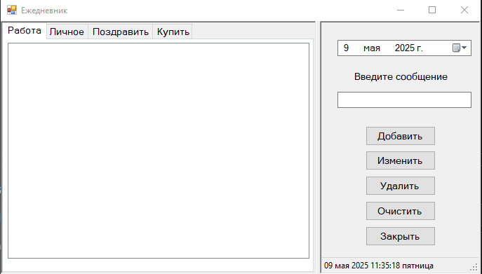

# diary
Keep track of your tasks in the diary

## 🚀 Возможности

- 🔖 Категории задач: `Работа`, `Личное`, `Поздравить`, `Купить`
- 📅 Удобный выбор даты
- 💬 Быстрое добавление сообщений
- ✏️ Редактирование и удаление записей
- 🧹 Очистка списка задач
- ❌ Закрытие приложения одной кнопкой
- 🕒 Отображение текущих даты и времени внизу

## 🖥️ Интерфейс

Справа располагается панель управления задачами, включающая:
- выбор даты;
- текстовое поле для ввода задачи;
- кнопки для основных действий: `Добавить`, `Изменить`, `Удалить`, `Очистить`, `Закрыть`.

Слева — табы для переключения между типами задач и большой список с задачами на выбранную дату и категорию.

## 🛠️ Технологии

- Windows Forms (WinForms)
- .NET Framework / .NET Core
- Язык программирования: C#
